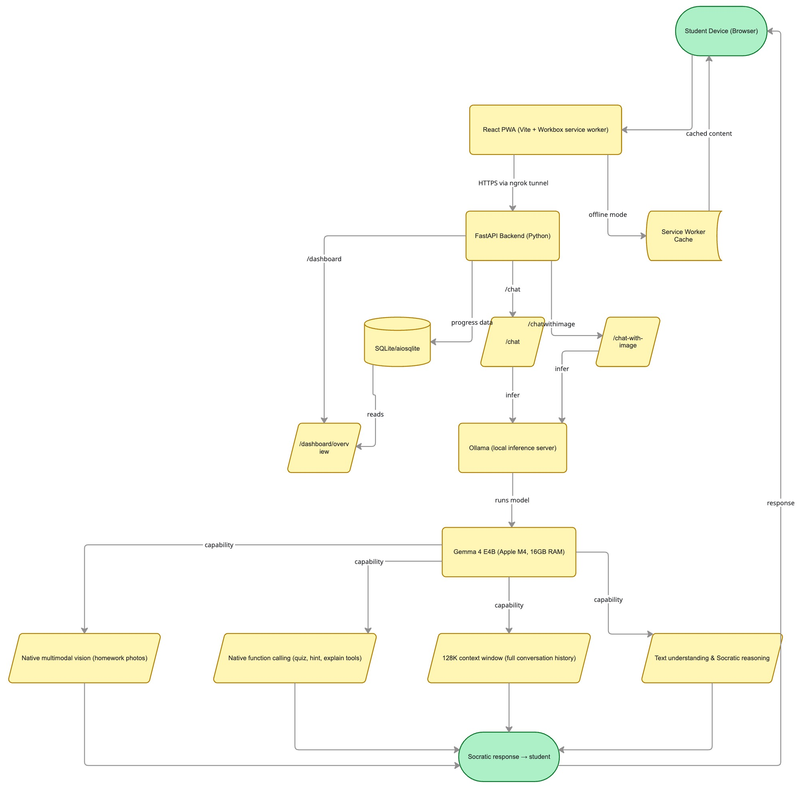

# ClassMate — Offline Socratic AI Tutor

> *Every student deserves a tutor. ClassMate makes that possible.*

ClassMate is a Progressive Web App powered by **Gemma 4** that gives every student their own personal Socratic tutor — one that works offline, speaks their language, and never just hands them the answer.

Built for the **[Gemma 4 Good Hackathon](https://www.kaggle.com/competitions/gemma-4-good-hackathon)** on Kaggle.

---

## Demo


> Student photographs homework → Gemma 4 reads it → asks one Socratic question → student discovers the answer themselves.

---

## The Problem

In thousands of schools across the world — rural India, sub-Saharan Africa, underserved neighborhoods in the US — students sit in overcrowded classrooms with one teacher for every 50 kids. When they go home, there is no tutor, no extra help, and often no reliable internet.

**Personalized education has always been a privilege. ClassMate changes that.**

---

## Features

| Feature | Description |
|---|---|
| Socratic teaching | Never gives answers — always asks the right guiding question |
| Homework vision | Student photographs worksheet → Gemma 4 reads and responds |
| Works offline | PWA with service worker caching — works with no WiFi |
| 10 languages | English, Spanish, Hindi, French, Arabic, Portuguese, Swahili, Bengali, Mandarin, Tamil |
| Teacher dashboard | Class-wide struggle analytics, language breakdown, student progress |
| Student tracker | SQLite progress database — tracks concepts per student |
| Installable | Full PWA — installs to home screen on any device |

---

## Architecture



### Why Gemma 4?
Gemma 4 E4B was the only model capable of all three things ClassMate needs at this size: multimodal vision, native multilingual output, and efficient local inference. No cloud. No cost. No data leaves the device.

### Why Ollama?
Ollama makes local Gemma 4 deployment a single command. Student conversations stay on the school's hardware — essential for communities where data privacy is non-negotiable.

---

## Gemma 4 Features Used

- **Native multimodal vision** — reads homework photos directly
- **Native multilingual output** — 10 languages, one model, no translation layer
- **Local inference via Ollama** — fully offline, no cloud dependency
- **128K context window** — full conversation history in every request
- **Thinking mode disabled** — `think: false` for concise, child-friendly responses
- **Native function calling** — quiz generator, hint tool, concept explainer

---

## Getting Started

### Prerequisites

- Python 3.11+
- Node.js 18+
- [Ollama](https://ollama.com) installed on your machine

### 1. Clone the repo

```bash
git clone https://github.com/YOUR_USERNAME/classmate.git
cd classmate
```

### 2. Pull Gemma 4

```bash
ollama pull gemma4:e4b
```

### 3. Start Ollama

```bash
OLLAMA_HOST=0.0.0.0 ollama serve
```

### 4. Set up the Python backend

```bash
python3 -m venv venv
source venv/bin/activate
pip install -r requirements.txt
uvicorn main:app --reload --port 8000
```

### 5. Set up the React frontend

```bash
cd frontend
npm install
npm run dev
```

### 6. Open the app

```
http://localhost:5173
```

Enter your name and start learning.

---

## Project Structure

```
classmate/
├── main.py                 FastAPI backend
├── requirements.txt        Python dependencies
├── classmate.db            SQLite database (gitignored)
└── frontend/
    ├── src/
    │   ├── App.jsx         Main chat UI
    │   ├── Dashboard.jsx   Teacher dashboard
    │   ├── cache.js        Offline response caching
    │   └── main.jsx        PWA service worker registration
    ├── public/
    │   ├── icon-192.png    PWA icon
    │   └── icon-512.png    PWA icon
    └── vite.config.js      Vite + PWA config
```

---

## API Endpoints

| Method | Endpoint | Description |
|---|---|---|
| POST | `/chat` | Socratic chat with conversation history |
| POST | `/chat-with-image` | Vision endpoint — accepts image + message |
| GET | `/dashboard/overview` | Aggregate class analytics |
| GET | `/dashboard/student/{name}` | Individual student progress |
| GET | `/health` | Health check |

### Example chat request

```bash
curl -X POST http://localhost:8000/chat \
  -H "Content-Type: application/json" \
  -d '{
    "message": "I dont understand fractions",
    "history": [],
    "language": "English",
    "student_name": "Priya"
  }'
```

### Example response

```json
{
  "reply": "That is okay! If you cut a pizza into 4 equal slices and ate one, what part of the pizza would you have eaten?"
}
```

---

## Offline Mode

ClassMate works without internet in two ways:

1. **App shell caching** — Workbox caches all HTML, CSS, and JS on first visit. The UI loads perfectly with no internet.

2. **Response caching** — every AI response is saved to `localStorage`. When offline, previously asked questions return instantly from cache. The more a student uses ClassMate online, the more powerful it becomes offline.

A yellow banner appears automatically when the device goes offline.

---

## Teacher Dashboard

Navigate to `/dashboard` to see:

- Total students and sessions
- Which concepts the class is struggling with most
- Subject breakdown (Math, Science, History, English)
- Language distribution across students
- Individual student progress and session history

---

## Supported Languages

| Language | Code |
|---|---|
| English | English |
| Spanish | Español |
| Hindi | हिन्दी |
| French | Français |
| Arabic | العربية |
| Portuguese | Português |
| Swahili | Kiswahili |
| Bengali | বাংলা |
| Mandarin | 中文 |
| Tamil | தமிழ் |

---


## Hackathon Tracks

This project was submitted to the following tracks:

- **Future of Education** — multi-tool Socratic agent that adapts to each student
- **Digital Equity & Inclusivity** — 10 languages, offline-first, works on any device
- **Ollama Special Prize** — showcases Gemma 4 running locally via Ollama

---

## What's Next

- **Fine-tuned ClassMate model** — domain-adapted on 500+ Socratic teaching examples using Unsloth
- **WebLLM integration** — Gemma running in-browser via WebAssembly for zero-server offline AI
- **Curriculum RAG pipeline** — RAG over local curriculum PDFs for grounded answers
- **Student streak system** — gamified progress to keep students coming back

---

## Tech Stack

| Layer | Technology |
|---|---|
| Frontend | React 18, Vite 8, vite-plugin-pwa, Workbox |
| Backend | FastAPI, Python 3.13, aiosqlite, httpx |
| AI | Gemma 4 E4B via Ollama |
| Database | SQLite (local, no cloud) |


---

## License

MIT License — see [LICENSE](./LICENSE)

---

## Acknowledgements

- [Google DeepMind](https://deepmind.google) for Gemma 4
- [Ollama](https://ollama.com) for making local LLM deployment simple
- [Kaggle](https://kaggle.com) for hosting the Gemma 4 Good Hackathon

---

*Built with Gemma 4 + Ollama · Gemma 4 Good Hackathon 2025*
